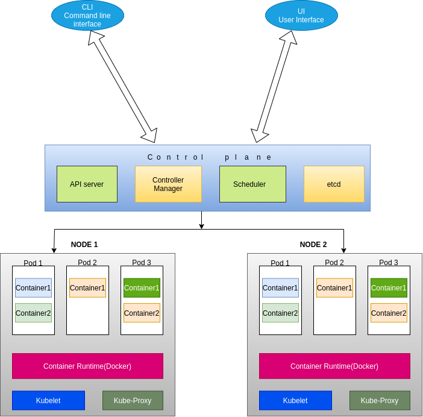

# k8s

https://codingfalcon.com/kubernetes-docker-containers-all-you-need-to-know/



```sh
sudo snap install kubectl --classic

```

https://kind.sigs.k8s.io/docs/user/quick-start/

```sh
curl -Lo ./kind https://kind.sigs.k8s.io/dl/v0.14.0/kind-linux-amd64
chmod +x ./kind
# mv ./kind /some-dir-in-your-PATH/kind
sudo mv ./kind /usr/bin
kind version

```

## Creating a Cluster 

```sh
kind create cluster
```

You can now use your cluster with:

```sh
kubectl cluster-info --context kind-kind
```

list your kind clusters:

```sh
kind get clusters
```

listing the nodes:

```sh
kubectl get nodes
```

## Deleting a cluster
```sh
kind delete cluster --name cluster_name
```
